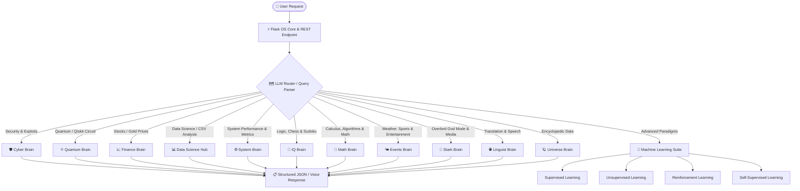

# ⚡ J.A.R.V.I.S. AI — Stark-Inspired Multi-Agent Cognitive OS

[](https://github.com/)
[](LICENSE)
[]()
[]()

J.A.R.V.I.S. (Just A Rather Very Intelligent System) is an advanced, Stark-inspired **multi-agent cognitive operating assistant** built on Python and Flask. Operating as a decoupled, asynchronous background system, J.A.R.V.I.S. integrates **12 specialized domain-specific neural brains**, a high-precision dataset router, quantum circuit simulations, native OS performance diagnostic telemetry, and an optimized voice/desktop container interface. 

Designed for both high-fidelity terminal execution and frame-free native desktop apps, it functions as a highly personal, deeply empathetic, and computationally omnipotent command hub.

---

## 🗺️ System Architecture

J.A.R.V.I.S. utilizes a **dynamic routing and cognitive delegation architecture**. Rather than bottlenecking all queries through a single generic model, queries are parsed, contextualized, and automatically routed to the most qualified cognitive node:



---

## 🧠 Cognitive Brain Modules Breakdown

At the heart of J.A.R.V.I.S. are specialized, isolated Python modules called **Brains**. Each is dedicated to executing heavy domain computations:

| Module | Filename | Primary Computational Functions |
| :--- | :--- | :--- |
| **Stark Brain** | `stark_brain.py` | God-Mode overrides, media controllers, active application automation, Stark-protocol operations. |
| **Quantum Brain** | `quantum_brain.py` | Native multi-qubit Qiskit quantum computing circuit simulations compiled on the local `qiskit-aer` backend. |
| **Cyber Brain** | `cyber_brain.py` | Advanced vulnerability analysis, payload generation simulators, and ethical hacking/recon guidance. |
| **Data Science Hub** | `data_science.py` | Global Kaggle dataset searches, local CSV file compilation, analytical models, and scikit-learn training. |
| **System Brain** | `system_brain.py` | CPU, Memory, Disk, and Network performance diagnostics using raw OS hardware statistics from `psutil`. |
| **Finance Brain** | `finance_brain.py` | Real-time stock market analysis, tickers, gold value tracking, and predictive forecasting via `yfinance`. |
| **IQ & Logic Brain** | `iq_brain.py` | Computational chess solvers, Sudoku backtrack algorithms, logic puzzle solvers, and IQ metrics. |
| **Math Brain** | `math_brain.py` | Scientific calculator functions, algebraic calculus, high-precision trigonometry, and matrix arithmetic. |
| **Linguist Brain** | `linguist_brain.py` | Multi-language translation protocols and linguistic syntax mapping. |
| **Universe Brain** | `universe_brain.py` | Encyclopedic timeline queries, historical event mapping, and cosmic constants reference directory. |
| **Events Brain** | `events_brain.py` | Active sports scorecard APIs, real-time localized weather fetching, and global box office telemetry. |

---

## 🛠️ The Advanced Machine Learning Suite

J.A.R.V.I.S. has integrated scripts covering the absolute spectrum of modern artificial intelligence pipelines:

1. **Supervised Learning (`supervised_learning.py`):** Handles labeled dataset prediction models and classical model evaluation curves.
2. **Unsupervised Learning (`unsupervised_learning.py`):** Cluster maps, Dimensionality Reduction (PCA), and structural outlier segmentation.
3. **Reinforcement Learning (`reinforcement_learning.py`):** Q-learning and state policy maps simulated for dynamic game environments.
4. **Self-Supervised & Transfer Learning (`transfer_learning.py` / `self_supervised_learning.py`):** Pre-trained feature extractor leverage and contrastive learning maps.

---

## 🖥️ User Interfaces: App-Mode & Native Desktop

J.A.R.V.I.S. features two deployment topologies to circumvent traditional desktop application limitations:

### 1. 🌐 Web Interface (Flask backend)
Renders a beautiful glassmorphic control room directly on a port-isolated web portal (`http://127.0.0.1:5000`).

### 2. 𝌹 Frameless Desktop Container (`desktop.py` / `run_jarvis.py`)
Utilizes a native, hardware-accelerated **Chromium App Mode** wrapper (bypassing heavyweight Electron wrappers). It launches a clean, borderless browser instance acting exactly like a native Windows executable window, powered in the background by a daemonized Flask thread.

---

## 🚀 Quick Start Guide (Windows Setup)

Ensure you have **Python 3.10+** installed on your system.

### 1. Clone & Navigate to Repository
```bash
git clone https://github.com/your-username/JARVIS-AI.git
cd JARVIS-AI
```

### 2. Run the Automatic Boot Loader
J.A.R.V.I.S. is shipped with an automated bootstrap runner that creates a virtual environment, activates it, and brings up the modular network:

```powershell
# Double-click the bat file or run it via terminal
./Launch_JARVIS.bat
```

*Alternatively, boot the system manually:*

```bash
# Initialize and activate virtual environment
python -m venv venv
.\venv\Scripts\activate

# Install dependencies
pip install -r requirements.txt

# Launch J.A.R.V.I.S. OS Core
python run_jarvis.py
```

---

## 🔬 Core Technologies & APIs

*   **Quantum Backend:** `qiskit` & `qiskit-aer`
*   **Real-time Analytics:** `pandas` & `scikit-learn`
*   **System Diagnostics:** `psutil`
*   **Market Data:** `yfinance`
*   **External Datasets:** `kaggle` & Hugging Face `datasets`
*   **Server Framework:** `flask` + `flask-cors`
*   **App Mode:** Chromium Native App Protocols

---

## 🔒 Safety, Guardrails & Security Policies

*   **Isolated Environments:** The Cyber Brain operates strictly under sandboxed environments and simulates cybersecurity scripts safely without external network exposure.
*   **Hardware Protections:** The System Brain accesses read-only performance APIs (`psutil`) protecting local system operations.
*   **Zero-Phoning Home:** All calculations (including stock parsing, quantum circuit logic, and mathematics) are routed through authenticated open APIs and local execution modules, keeping your personal workspace 100% private.

***

*“Sir, all systems are green. I am online and awaiting your command.”* — **J.A.R.V.I.S.**
